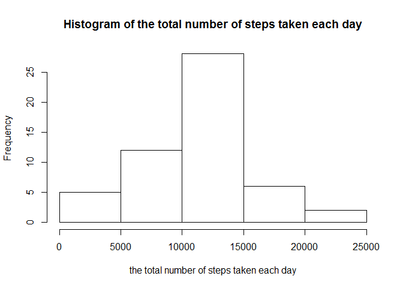
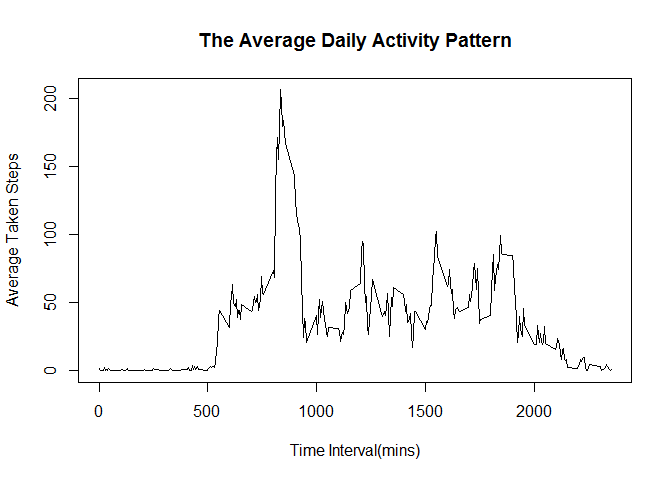
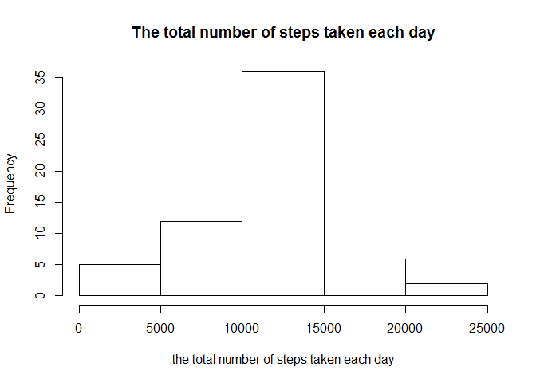
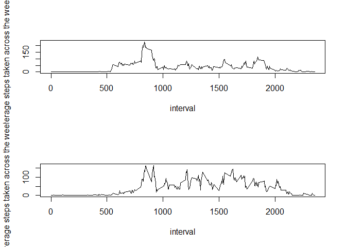

# Reproducible Research: Peer Assessment1

##Loading and preprocessing the data

```r
library("plyr")
```

```
## Warning: package 'plyr' was built under R version 3.2.5
```

```r
setwd("E:/Cousera-Data Science/Reproducible Research/CourseProject1/repdata-data-activity")
activity<-read.csv("activity.csv")
```

##What is mean total number of steps taken per day?

```r
##ignore the missing values in the dataset
activity1<-activity[!is.na(activity$steps),]
##total steps of number each day
steps_num<-ddply(activity1,.(date),function(x)sum(x$steps))
##The histgram of the total number of steps taken each day
hist(steps_num$V1,main=paste("Histogram of","the total number of steps taken each day"),xlab="the total number of steps taken each day")
```

<!-- -->

```r
##Obtain the median and mean of the number of steps taken each day 
allinfo<-summary(steps_num$V1)
median_steps<-allinfo["Median"]
mean_steps<-allinfo["Mean"]
report1<-paste("The mean and median total number of steps taken per day is", median_steps, "and",mean_steps)
report1
```

```
## [1] "The mean and median total number of steps taken per day is 10760 and 10770"
```


##What is the average daily activity pattern?

```r
##The average daily activity pattern
pattern<-ddply(activity1,.(interval),function(x) mean(x$steps))
plot(pattern,xlab="Time Interval(mins)",ylab="Average Taken Steps",main="The Average Daily Activity Pattern",type="l")
```

<!-- -->

```r
##the 5-minute interval containing the maximum number of steps
interval_max<-pattern$interval[which(pattern$V1==max(pattern$V1))]
report2<-paste("The 5-minute interval of",interval_max,"contains the maximum number of steps on average across all the days in the dataset")
report2
```

```
## [1] "The 5-minute interval of 835 contains the maximum number of steps on average across all the days in the dataset"
```


##Imputing missing values

```r
##the number of NA in records
NA_num<-sum(is.na(activity$steps))
report3<-paste("The number of missing values in the dataset is", NA_num)


##fill in the missing values with the mean for that 5-minute interval
##which is the NA values
which_na<-which(is.na(activity$steps))
##which interval the NA values corresponding to 
whichinterval<-activity[which_na,]$interval
indx<-sapply(whichinterval,function(x){which(pattern$interval==x)})
##the value which is going to be filled in
fillNA<-pattern[indx,]$V1
activity[which_na,]$steps<-fillNA
report4<-c("The missing values in the dataset is filled with the mean for that 5-minute interval")
##the dataset 'activity' now is the dataset with the missing values filled in


##make a histogram of the total number of steps taken each day
total_steps<-ddply(activity,.(date), function(x) sum(x$steps))
hist(total_steps$V1,xlab="the total number of steps taken each day",main="The total number of steps taken each day")
```

<!-- -->

```r
allinfo2<-summary(total_steps$V1)
median<-allinfo2["Median"]
mean<-allinfo2["Mean"]
report5<-paste("The median and mean total number of steps taken per day with missing values filled in is", median,mean)
report6<-c("The median is increased and the mean unchanged relative to the missing values unfilled.")
report3
```

```
## [1] "The number of missing values in the dataset is 2304"
```

```r
report4
```

```
## [1] "The missing values in the dataset is filled with the mean for that 5-minute interval"
```

```r
head(activity)
```

```
##       steps       date interval
## 1 1.7169811 2012-10-01        0
## 2 0.3396226 2012-10-01        5
## 3 0.1320755 2012-10-01       10
## 4 0.1509434 2012-10-01       15
## 5 0.0754717 2012-10-01       20
## 6 2.0943396 2012-10-01       25
```

```r
report5
```

```
## [1] "The median and mean total number of steps taken per day with missing values filled in is 10770 10770"
```

```r
report6
```

```
## [1] "The median is increased and the mean unchanged relative to the missing values unfilled."
```

##Are there differences in activity patterns between weekdays and weekends?

```r
library("chron")
```

```
## Warning: package 'chron' was built under R version 3.2.5
```

```r
##Create a new factor "week" with 2 levels-"weekday","weekend"
date<-as.Date(activity$date)
activity$week<-rep(0,each=length(activity))
activity$week[is.weekend(date)]<-"weekend"
activity$week[!is.weekend(date)]<-"weekday"
activity$week<-as.factor(activity$week)

##make a panel plot containing a time series plot of the 5-minute interval and the average number of steps taken,averaged across all weekdays or weekend days.
pattern2<-ddply(activity,.(interval,week),function(x) mean(x$steps))
data_weekend<-pattern2[pattern2$week=="weekend",]
data_weekday<-pattern2[pattern2$week=="weekday",]
par(mfrow=c(2,1))
plot(data_weekday$interval,data_weekday$V1,type="l",xlab="interval",ylab="average steps taken across the weekday")
plot(data_weekend$interval,data_weekend$V1,type="l",xlab="interval",ylab="average steps taken across the weekend")
```

<!-- -->


